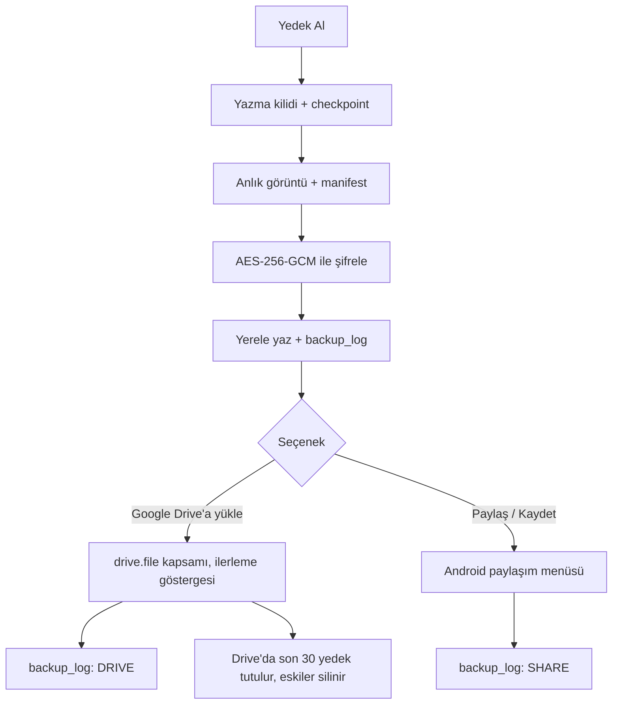
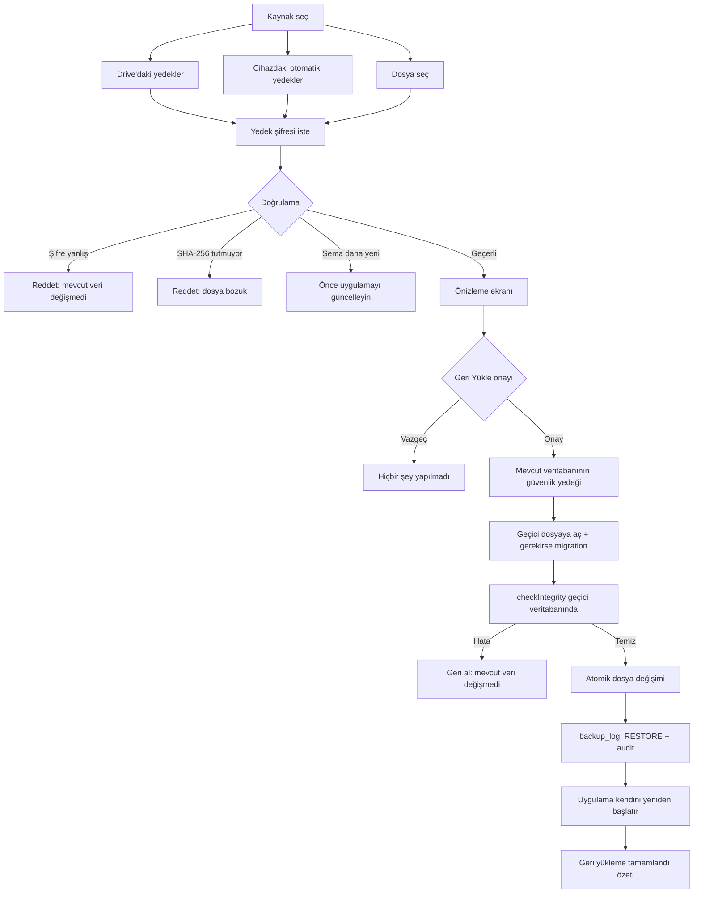

# Yedekleme ve Geri Yükleme

Veri yalnızca telefonda durur. Telefonun kaybolması, bozulması veya sıfırlanması **tüm
işletme verisinin kaybı** demektir. Bu doküman maliyet motoru kadar kritiktir ve
**Faz 2'de eksiksiz** hayata geçirilir.

Tek cümlelik sözleşme:

> Yedek dosyası + yedek şifresi elindeyse, **başka bir telefonda**, uygulamayı yeni kurup
> veriyi son haline getirebilirsin. Cihazın kendisine ait hiçbir şeye ihtiyaç yoktur.

---

## 1. Yedek dosyası (`.sbk`)

Ad biçimi: `SungerYedek_2026-09-17_1432.sbk` (yerel saat, `Europe/Istanbul`).

### 1.1 İçerik

Şifrelenmeden önceki düz içerik, iki girdili bir arşivdir:

```
payload.zip
├── database.db      SQLite anlık görüntüsü (düz, SQLCipher şifresi YOK)
└── manifest.json
```

`manifest.json`:

```json
{
  "format_version": 1,
  "app_version": "1.4.2",
  "app_build": 142,
  "schema_version": 7,
  "created_at": "2026-09-17T14:32:05+03:00",
  "created_at_epoch_ms": 1789738325000,
  "device_id": "b7f1…",
  "device_name": "Patron - Galaxy A54",
  "costing_method": "FIFO",
  "last_transaction_at": "2026-09-17T13:58:11+03:00",
  "table_counts": { "sales": 1284, "sale_items": 3901, "customers": 142, "…": 0 },
  "content_sha256": "…"
}
```

- `content_sha256`, **`database.db` dosyasının** SHA-256 özetidir.
- `table_counts` her tablo için satır sayısını içerir; geri yükleme önizlemesinde ve
  yedek-sonrası doğrulamada kullanılır.

### 1.2 Tutarlı anlık görüntü

Yedek **açık transaction yokken** alınır:

1. Yazma kuyruğu kısa süreliğine durdurulur (repository katmanında tek bir yazma kilidi).
2. `PRAGMA wal_checkpoint(TRUNCATE)`.
3. Anlık görüntü alınır:
   - **SQLCipher `sqlcipher_export`** ile şifresiz geçici veritabanına aktarım (tercih edilen),
   - desteklenmezse `VACUUM INTO '<geçici yol>'`.
4. Kilit bırakılır.

> **Neden şifresiz anlık görüntü?** Çünkü hedef, yedeğin **yalnızca yedek şifresiyle**
> açılabilmesi. Veritabanı dosyası SQLCipher anahtarıyla kalsaydı, o anahtar Android
> Keystore'da olduğu için telefon kaybolduğunda yedek de açılamazdı. Dosya diskte şifresiz
> **kalmaz**: geçici dosya uygulamanın özel dizininde oluşturulur, hemen şifrelenir ve
> `finally` bloğunda üzerine yazılarak silinir.

### 1.3 Şifreleme

| Öğe | Seçim |
|---|---|
| Algoritma | **AES-256-GCM** |
| Anahtar türetme | **Argon2id** (m=64 MiB, t=3, p=1); platformda desteklenmezse **PBKDF2-HMAC-SHA256, ≥ 600.000 iterasyon** |
| Tuz (salt) | 16 bayt, her yedekte yeni, rastgele |
| Nonce | 12 bayt, her yedekte yeni, rastgele |
| Kimlik doğrulama | GCM etiketi 16 bayt; başlık **AAD** olarak bağlanır |

Dosya düzeni:

```
offset  uzunluk  alan
0       4        sihirli sayı "SBK1"
4       1        format sürümü (1)
5       1        KDF kimliği (1 = Argon2id, 2 = PBKDF2-HMAC-SHA256)
6       4        KDF parametreleri (iterasyon / bellek, big-endian)
10      16       salt
26      12       nonce
38      N        AES-256-GCM şifreli payload.zip
38+N    16       GCM etiketi
```

İlk 38 bayt (başlık) GCM'e **AAD** olarak verilir → başlıktaki tek bir bayt değiştirilirse
çözme başarısız olur.

> Şifre çözme büyük dosyalarda belleği doldurmamak için akış (streaming) biçiminde,
> ayrı bir `Isolate` içinde yapılır.

### 1.4 Yedek şifresi

- İlk kurulumda belirlenir: **en az 8 karakter**, iki kez girilir.
- Açık uyarı gösterilir:
  > **"Bu şifreyi unutursanız yedekleriniz açılamaz. Bir kâğıda yazıp güvenli yerde
  > saklayın."**
- Ayarlar'dan değiştirilebilir. Değişiklikten **sonraki** yedekler yeni şifreyi kullanır;
  eski yedekler eski şifresiyle açılmaya devam eder. Bu, geri yükleme ekranında açıkça yazar.
- Şifre **hiçbir yerde düz metin saklanmaz.** Otomatik yedek de şifreye ihtiyaç duyduğu için
  şifreden türetilen anahtar materyali `flutter_secure_storage`'da tutulur; kullanıcı
  şifreyi değiştirdiğinde yenilenir.
- Şifre doğrulaması için ayrıca bir `verifier` (şifreden türetilmiş, tuzlu özet) saklanır —
  yanlış şifre, koca dosyayı çözmeye kalkmadan hızlıca reddedilebilsin diye.

---

## 2. Tek tuşla yedek al

Ana sayfada ve Menü'de belirgin **"Yedek Al"** butonu. Dokununca:



- **Google Drive:** bağlantı Ayarlar'dan bir kez yapılır (`google_sign_in`, `drive.file`
  kapsamı). Yedekler kullanıcının Drive'ında **görünür** bir `Sünger Yedekleri` klasörüne
  yüklenir — appDataFolder kullanılmaz, çünkü kullanıcının dosyaya kendi başına ulaşabilmesi
  gerekir. Drive'da **son 30** yedek tutulur, eskiler silinir.
- **Paylaş / Kaydet:** `share_plus` ile Android paylaşım menüsü (WhatsApp, e-posta, Dosyalar).
- Her iki sonuç da `backup_log`'a yazılır (`destination`, `size_bytes`, `sha256`, `result`).

---

## 3. Otomatik yedek

| Tetikleyici | Kural |
|---|---|
| Günlük | Her gün, varsayılan **20:00** (Ayarlar'dan değiştirilebilir) — `workmanager` |
| Açılış | Günün ilk açılışında, önceki gün yedeği alınmamışsa |
| Riskli işlem öncesi | Yedekten geri yükleme, şema migration'ı, **stok sayımı onayı**, **maliyet yöntemi değişikliği** |

- **Yerel saklama:** cihazda son **7 günlük** + son **4 haftalık** yedek tutulur.
  Haftalık kopya olarak her haftanın **ilk** yedeği korunur. Bu kuralın doğru dosyaları
  sildiği testle doğrulanır.
- Drive bağlıysa otomatik yedek Drive'a da yüklenir. **"Yalnızca Wi-Fi"** seçeneği vardır
  (varsayılan açık).
- Riskli işlem öncesi yedekler `trigger = PRE_RISK` / `PRE_MIGRATION` ile işaretlenir ve
  temizleme kuralından **muaftır** (en az 30 gün tutulur).

---

## 4. Uyarılar

- Ana sayfanın üstünde sürekli görünen yedek durumu:
  `Son yedek: bugün 20:00 · Drive ✓`
- Son **cihaz dışı** yedek (Drive'a yükleme veya paylaşım) **3 günden** eskiyse ana sayfada
  kırmızı uyarı bandı ve **"Şimdi yedekle"** butonu. Eşik Ayarlar'dan değiştirilebilir.
- Otomatik yedek başarısız olursa yerel bildirim gösterilir ve durum bandı kırmızıya döner.
- Hiç yedek alınmamışsa uyarı ilk günden görünür.

---

## 5. Tek tuşla yedekten yükle

Giriş noktaları: **Menü → "Yedekten Yükle"**, ve kurulum sihirbazının ilk ekranındaki
**"Yeni başla / Yedekten geri yükle"** seçimi (telefon değişikliği senaryosu).



### 5.1 Doğrulama sırası

1. Başlık okunur (sihirli sayı, format sürümü, KDF kimliği).
2. Şifre `verifier` ile hızlı kontrol edilir → yanlışsa hemen reddedilir.
3. Payload çözülür (GCM etiketi doğrulanır) → değiştirilmiş bayt varsa reddedilir.
4. `manifest.json` okunur, `database.db`'nin SHA-256'sı hesaplanıp karşılaştırılır.
5. Şema sürümü kontrolü:
   - **Yedek daha eski şemada** → yükleme sonrası migration çalıştırılır.
   - **Yedek daha yeni uygulama sürümünde** → *"Önce uygulamayı güncelleyin"* mesajıyla
     durdurulur.

### 5.2 Önizleme ekranı

Yedek tarihi, cihaz adı, son işlem tarihi, müşteri / ürün / satış / tahsilat sayıları ve
**mevcut verilerle karşılaştırma** (yan yana iki sütun).

Yedek mevcut veriden eskiyse kırmızı uyarı:

> **"Bu yedek, telefondaki verilerden 3 gün eski. Sonraki işlemler kaybolacak."**

Ardından **tek bir "Geri Yükle" onayı**.

### 5.3 Atomik değişim (en kritik adım)

```
1. Mevcut veritabanının güvenlik yedeği alınır  → guvenlik_yedegi_<zaman>.sbk
2. Yeni veritabanı GEÇİCİ dosyaya açılır        → restore_tmp.db
3. Gerekirse migration GEÇİCİ dosyada çalışır
4. checkIntegrity() GEÇİCİ dosyada çalışır
5. Yalnızca 2–4 başarılıysa:
      - açık bağlantılar kapatılır
      - rename(restore_tmp.db → app.db)   ← atomik
      - WAL/SHM artıkları temizlenir
6. Herhangi bir adımda hata → geçici dosya silinir, MEVCUT VERİ HİÇ DEĞİŞMEMİŞTİR
```

**Değişmez:** adım 5'e gelinmediği sürece mevcut `app.db` dosyasına **hiç dokunulmaz**.

Geri yüklenen veritabanı, cihazın **kendi** SQLCipher anahtarıyla yeniden şifrelenir —
böylece yeni telefonda kendi Keystore anahtarı geçerli olur.

Sonrasında uygulama kendini yeniden başlatır ve "Geri yükleme tamamlandı" özetini gösterir.
Güvenlik yedeğine **Menü → Yedekler** ekranından dönülebilir.

---

## 6. Yedekler ekranı

Tüm yerel ve Drive yedeklerinin tek listesi:

| Sütun | İçerik |
|---|---|
| Tarih | `17.09.2026 14:32` |
| Boyut | `4,2 MB` |
| Konum | Cihaz · Drive · (ikisi birden) |
| Tür | Otomatik · Manuel · Güvenlik yedeği · Migration öncesi |

İşlemler: **paylaş**, **geri yükle**, **sil** (yalnızca yerel otomatik yedekler için;
güvenlik yedekleri ve migration öncesi yedekler korunur). Üstte son yedek durumu ve Drive
bağlantı durumu.

---

## 7. Hata senaryoları

| Senaryo | Davranış |
|---|---|
| Yanlış yedek şifresi | Türkçe hata, mevcut veri değişmez, `backup_log` FAIL |
| Bozuk / değiştirilmiş dosya | GCM etiketi veya SHA-256 tutmaz → reddedilir |
| Dosya kesilmiş (eksik indirme) | Başlık/uzunluk kontrolü → reddedilir |
| Yedek daha yeni şema sürümünde | "Önce uygulamayı güncelleyin", yükleme yapılmaz |
| Yedek daha eski şema sürümünde | Migration çalışır, `checkIntegrity` doğrular |
| Yükleme ortasında hata (süreç öldürüldü, disk doldu) | Atomik değişim yapılmadığı için mevcut veri sağlam; güvenlik yedeği yerinde durur |
| Disk dolu (yedek alırken) | İşlem iptal, kısmi dosya silinir, kullanıcıya yer açma uyarısı |
| Drive oturumu düşmüş | Yeniden bağlanma istenir; yedek yerelde durur, paylaşma önerilir |
| Drive kotası dolu | Hata mesajı + en eski Drive yedeklerini silme önerisi |
| İnternet yok | Yedek yerelde alınır, "Paylaş" seçeneği öne çıkar, Drive kuyruğa alınır |
| `checkIntegrity` geri yüklemede fark bulur | Yükleme **geri alınır**, rapor gösterilir |
| Yedek sırasında uygulama kapanır | Geçici dosya bir sonraki açılışta temizlenir |

---

## 8. Zorunlu testler

Faz 2'nin geçme şartı. Hepsi otomatik.

| # | Test | Beklenen |
|---|---|---|
| 1 | Veri oluştur → yedek al → veritabanını sil → yedeği yükle | **Tüm tabloların içerik özeti birebir aynı** |
| 2 | Yanlış şifre ile yükleme | Reddedilir, mevcut veri değişmez |
| 3 | Bozuk dosya (tek bayt değiştirilmiş) | Reddedilir, mevcut veri değişmez |
| 4 | Yükleme ortasında hata simülasyonu | Mevcut veri değişmez, güvenlik yedeği oluşmuş |
| 5 | Eski şema sürümündeki yedek | Yüklenir, migration sonrası doğru çalışır |
| 6 | Daha yeni sürümün yedeği | Reddedilir |
| 7 | **Farklı cihaz anahtarı** (yeni kurulum simülasyonu) | Yalnızca yedek şifresiyle açılır |
| 8 | Saklama kuralı (7 günlük + 4 haftalık) | Doğru eski dosyalar silinir, korunacaklar kalır |
| 9 | Altın Senaryo 11. adım | 1–10. adımlardaki tüm bakiye, stok ve maliyetler birebir aynı |

**Test 1 ve 9'un ölçütü:** her tablo için satırların kanonik sıralanmış özetinin (tüm
kolonlar dahil) SHA-256'sı, yedek öncesi ve sonrası aynı olmalı. Yalnızca satır sayısı
karşılaştırması yeterli sayılmaz.

**Test 7'nin kurgusu:** yedek alınır, uygulama verisi ve secure storage tamamen silinir
(yeni telefon simülasyonu), yeni bir SQLCipher anahtarı üretilir, yedek yalnızca yedek
şifresiyle yüklenir ve veri eksiksiz gelir.

---

## 9. Güvenlik notları

- Yedek şifresi ve türetilmiş anahtar materyali **yalnızca** `flutter_secure_storage`'da.
- Loglara şifre, anahtar veya iş verisi **yazılmaz**; `backup_log` yalnızca meta veri tutar.
- Şifresiz geçici anlık görüntü uygulamanın özel dizininde oluşur, dış depolamaya asla
  yazılmaz, işlem bitince üzerine yazılarak silinir.
- Drive kapsamı `drive.file` — uygulama yalnızca kendi oluşturduğu dosyaları görür,
  kullanıcının Drive'ının geri kalanına erişemez.
- `.sbk` dosyası WhatsApp'a gönderildiğinde bile şifreli olduğu için okunamaz; güvenlik
  yalnızca yedek şifresine dayanır. Kullanıcıya bu açıkça anlatılır.
