# Veri Modeli (ERD)

Faz 0 çıktısı. Ölçekler, kısıtlar ve trigger kuralları `docs/ARCHITECTURE.md` Bölüm 3 ve 6'da.

**Okuma notları**

- Tüm `id` kolonları **UUID v7** (`TEXT`). Sıralanabilir olduğu için hem birincil anahtar
  hem de zaman kırıcı (tie-breaker) olarak kullanılır.
- Tüm zaman damgaları **UTC epoch milisaniye** (`INTEGER`).
- Tüm sayısal değerler **sabit ölçekli INTEGER**: `money` = kuruş ×100, `price` = ×10.000,
  `vol` = m³ ×10⁶, `dim` = cm ×100, `rate` = % ×100, `pcs` = adet.
- 🔒 ile işaretli tablolar **append-only**'dir (UPDATE/DELETE trigger ile engellenir).
- Her iş kaydında `created_at`, `created_by` (users.id) ve `device_id` bulunur; diyagramlarda
  tekrar etmemek için yalnızca ilk tabloda gösterilmiştir.

## 0. SPEC Bölüm 26 ile uyum

`docs/SPEC.md` §26 "minimum tablolar" listesinin tamamı bu modelde karşılanır:

| SPEC §26 tablosu | Bu modelde | Not |
|---|---|---|
| `users`, `roles`, `permissions` | aynı | v1'de tek ADMIN, arayüz gizli |
| `products`, `product_variants` | aynı | |
| `price_lists`, `price_list_items` | aynı | |
| `suppliers`, `customers` | aynı | |
| `purchases`, `purchase_items` | aynı | |
| `purchase_orders` | **yok** | Sipariş akışı BRIEF'te hiç geçmiyor; v1 kapsamı dışı (D-16) |
| `inventory_batches` | aynı | |
| `sales_quotes`, `sales`, `sale_items` | aynı | SPEC adlandırması korundu |
| `stock_movements` | aynı | BRIEF §6'daki genişletilmiş kolon listesiyle |
| `stock_adjustments` | aynı | Fire/hasar ve stok düzeltme (SPEC §17); başlık + `stock_adjustment_items` |
| `customer_ledger`, `supplier_ledger` | aynı | |
| `collections`, `supplier_payments` | aynı | |
| `expenses` | aynı | `expense_categories` ile |
| `audit_logs` | aynı | |

BRIEF §6'nın ek tablolarının tamamı da modeldedir (`locations`, `settings`,
`document_sequences`, `command_log`, `cash_accounts`, `account_movements`,
`cost_allocations`, `payment_allocations`, `supplier_payment_allocations`, `sale_returns`,
`sale_return_items`, `purchase_returns`, `purchase_return_items`, `purchase_expenses`,
`cost_adjustments`, `stock_counts`, `stock_count_items`, `cutting_orders`,
`cutting_order_sources`, `cutting_order_results`, `instruments`, `instrument_events`,
`expense_categories`, `opening_balances`, `backup_log`).

**Tek sapma:** SPEC §26 "para için DECIMAL/NUMERIC kullan" diyor. SQLite'ta kesin ondalık tip
olmadığı için bunun yerine sabit ölçekli INTEGER kullanılır — SPEC'in asıl amacı olan
"floating-point hatası olmasın" (SPEC §30.8) kuralı böylece daha güçlü şekilde sağlanır.
Gerekçe: `docs/DECISIONS.md` D-02.

---

## 0.1 Seed: 12 ürün ve fiyat katsayıları (SPEC §1 + §13)

Baz ürün **Beyaz Sünger = 1,00**. Fiyat = baz TL/m³ × katsayı (SPEC §13).

| # | Ürün | Katsayı | `price_coefficient` |
|---|---|---|---|
| 1 | Beyaz Sünger | 1,00 | `10000` |
| 2 | D22 Gri | 1,40 | `14000` |
| 3 | D28 Gri | 1,71 | `17100` |
| 4 | D32 Gri | 1,91 | `19100` |
| 5 | D35 Sert | 2,24 | `22400` |
| 6 | D35 Yumuşak | 2,24 | `22400` |
| 7 | D35 140×240 | 2,24 | `22400` |
| 8 | Kuş Tüyü | 1,56 | `15600` |
| 9 | 30 Dream Soft | 1,83 | `18300` |
| 10 | HR35 | 2,56 | `25600` |
| 11 | HR35 140×240 | 2,56 | `25600` |
| 12 | Eko Gri D18 | 1,23 | `12300` |

7 ve 11 numaralı ürünler katsayı olarak 5/6 ve 10 ile aynıdır ama **ayrı ürünlerdir**
(müşteri kararı, BRIEF §1.6) ve kartlarında `default_width = 14000`,
`default_height = 24000` (140×240 cm) gelir.

---

## 1. Genel bakış

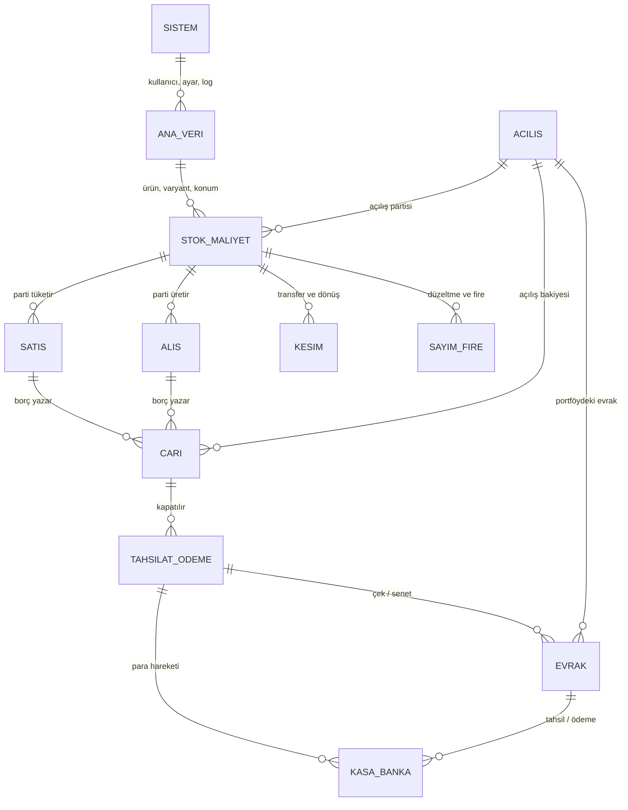

---

## 2. Sistem, kimlik ve log

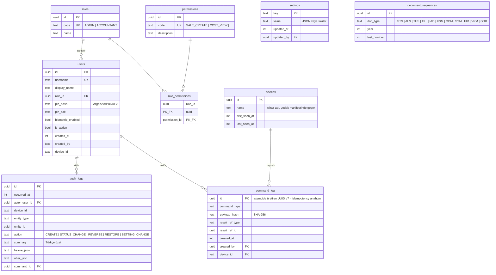

🔒 `command_log`, `audit_logs`

- `document_sequences` UK: `(doc_type, year)`. Numara atama aynı transaction içinde
  `UPDATE ... last_number = last_number + 1` ile yapılır; işlem geri alınırsa numara da geri
  alınır → **boşluk oluşmaz**.
- `command_log.id` birincil anahtar olduğu için aynı UUID'nin ikinci INSERT'i çakışır →
  çift kayıt engellenir. Kayıt iş kayıtlarıyla aynı transaction'da yazılır.
- v1'de tek `ADMIN` kullanıcı vardır, kullanıcı yönetimi arayüzü gizlidir. Tablolar
  ileriye hazırlık içindir (`docs/FUTURE_SYNC.md`).

**Ayar anahtarları (`settings`)**

| key | örnek değer | açıklama |
|---|---|---|
| `costing_method` | `FIFO` \| `WEIGHTED_AVERAGE` | ilk stok hareketinden sonra kilitli |
| `costing_method_locked_at` | epoch | kilit zamanı |
| `default_price_mode` | `EXCL` \| `INCL` | belge varsayılanı |
| `default_vat_rate` | `2000` | %20 |
| `allowed_vat_rates` | `[0,100,1000,2000]` | Ayarlar'dan düzenlenir |
| `company_*` | ad, adres, vergi dairesi, logo yolu | PDF başlığı |
| `backup_auto_time` | `20:00` | otomatik yedek saati |
| `backup_offsite_warn_days` | `3` | cihaz dışı yedek uyarı eşiği |
| `backup_wifi_only` | `true` | Drive yüklemesi |
| `drive_folder_id` | Drive klasör kimliği | "Sünger Yedekleri" |
| `hide_cost_mode` | `false` | maliyeti gizle |

---

## 3. Ana veri

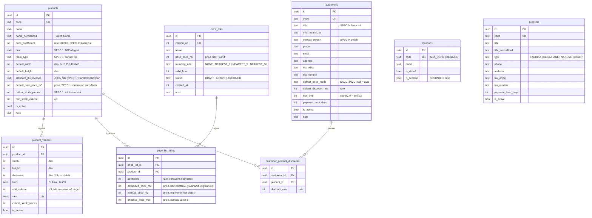

- `product_variants` UK: `(product_id, width, height, thickness, kind)`.
- `unit_volume` Dart'ta `Decimal` ile hesaplanıp yazılır (SQL'de çarpma yapılmaz); böylece
  stok ekranındaki m³ toplamları saf `SUM()` ile alınabilir.
- Fiyat listesi fiyatları **KDV hariç** saklanır. Yeni versiyon oluşturulurken eski versiyon
  `ARCHIVED` olur ama **silinmez ve değişmez** — geçmiş satışlar kendi versiyonuna referans
  verir (`sale_items.price_list_id`).
- "D35 140×240" ve "HR35 140×240" **ayrı ürünlerdir** (müşteri kararı); kartlarında standart
  en/boy 140×240 gelir (`default_width`, `default_height`).
- **TODO(SPEC):** 12 ürün ve `price_coefficient` değerleri SPEC'ten seed'lenecek.

---

## 4. Stok ve maliyet

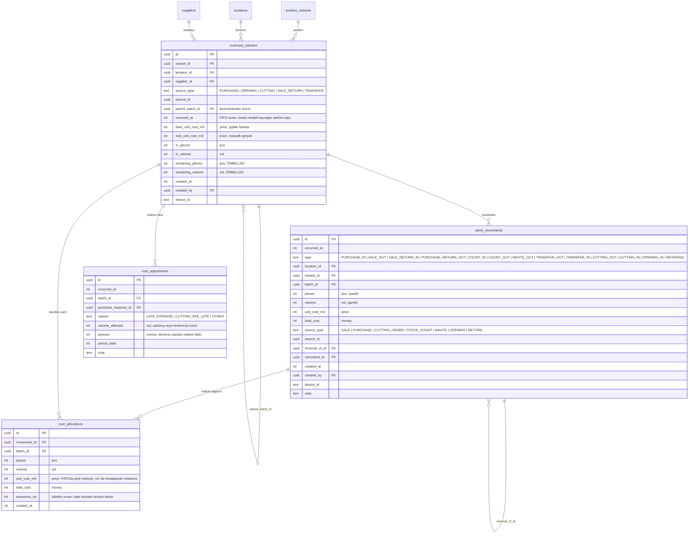

🔒 `stock_movements`, `cost_allocations`, `cost_adjustments`

**Kısıtlar**

- `CHECK (remaining_pieces >= 0 AND remaining_volume >= 0)` → negatif stok yasağının
  veritabanı tarafındaki güvencesi.
- `CHECK (remaining_pieces <= in_pieces AND remaining_volume <= in_volume)`.
- `CHECK (pieces <> 0)` ve `CHECK (volume <> 0)` — sıfır hareket yazılmaz.
- Hareket yönü ile tip tutarlılığı: `_IN`/`OPENING_IN` tiplerinde `pieces > 0`,
  `_OUT` tiplerinde `pieces < 0` (CHECK).
- `UNIQUE (reversal_of_id) WHERE reversal_of_id IS NOT NULL` → bir hareket **iki kez** ters
  çevrilemez.
- İndeksler: `(variant_id, location_id)`, `(batch_id)`, `(occurred_at)`,
  `(source_type, source_id)`; partide `(variant_id, location_id, received_at, id)` → FIFO
  taraması.

**Kesimdeki mal.** Ana depodaki parti kesime gönderilirken **silinmez**: kalanı düşülür ve
`KESIMDE` konumunda, aynı birim maliyeti taşıyan bir **çocuk parti** (`parent_batch_id`)
açılır. `locations.is_sellable = false` olduğu için bu parti FIFO tüketimine girmez, ama stok
değerinde ve ana sayfadaki "Kesimdeki Mal" kartında görünür.

---

## 5. Alış, masraf ve alış iadesi

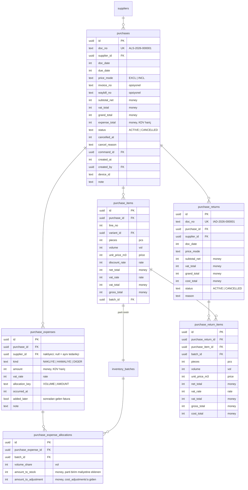

- Her `purchase_items` satırı **tam bir parti** üretir (`batch_id`). Çıplak birim fiyat
  partiye `bare_unit_cost_m3`, masraf dağıtıldıktan sonraki değer `real_unit_cost_m3` olur.
- `purchase_expense_allocations`, sonradan gelen masrafın **stokta kalan** ve
  **satılmış/firelenmiş** kısımlara nasıl bölündüğünün denetim izidir
  (`amount_to_stock + amount_to_adjustment = pay`).
- Alış iadesi: `Σ purchase_return_items.pieces ≤ purchase_items.pieces` (domain kuralı +
  doğrulama sorgusu). İade edilen mal ilgili partiden **aynı maliyetle** çıkar
  (`PURCHASE_RETURN_OUT`), tedarikçi carisine alacak yazılır.

---

## 6. Teklif, satış ve satış iadesi

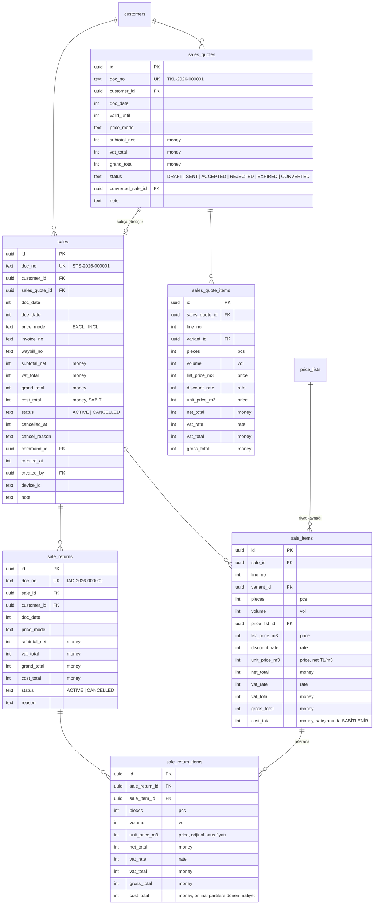

- `sale_items.cost_total` **satış anında sabitlenir** ve hiçbir koşulda değişmez.
- Teklif stok düşmez; `ACCEPTED` teklif "Satışa dönüştür" ile kopyalanır, `CONVERTED` olur.
- Satış iadesinde stok, orijinal satışın tükettiği partilere **`cost_allocations.sequence_no`
  tersinden** (son tüketilenden başlayarak) aynı maliyetle döner.
  > Doğrulama (Altın Senaryo 8): satış A partisinden 50, sonra B'den 10 adet tüketmişti;
  > 5 adetlik iade **B partisine** 3.165 TL/m³ ile döner (1,4 m³ → 4.431,00 TL).
- `Σ sale_return_items.pieces ≤ sale_items.pieces` (domain kuralı; iade satılan miktarı aşamaz).

---

## 7. Cari ve eşleştirme

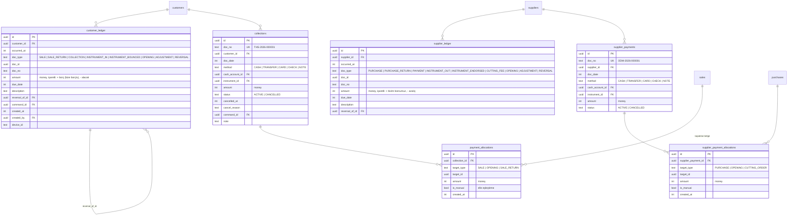

🔒 `customer_ledger`, `supplier_ledger`, `payment_allocations`, `supplier_payment_allocations`

- **Bakiye = `SUM(customer_ledger.amount)`** — yalnızca toplama, kesin. Ayrı bir bakiye
  kolonu tutulmaz (`checkIntegrity` bunu doğrular).
- Cariye **brüt** (KDV dahil) tutar yazılır.
- Tahsilat varsayılan olarak **vadesi en erken açık belgeleri** kapatır; elle eşleştirme de
  yapılabilir (`is_manual`). Vadesi geçen alacak, gecikme günü ve ortalama ödeme süresi
  `payment_allocations` üzerinden hesaplanır.
- `CHECK (amount > 0)` eşleştirmelerde; `Σ allocations ≤ collection.amount` domain kuralı.

---

## 8. Kasa, banka ve gider

```mermaid
erDiagram
    cash_accounts ||--o{ account_movements : ""
    cash_accounts ||--o{ transfers : "from"
    cash_accounts ||--o{ transfers : "to"
    expense_categories ||--o{ expenses : ""
    expenses ||--o{ account_movements : "ödeme"

    cash_accounts {
        uuid id PK
        text code UK
        text name
        text type "KASA | BANKA | POS"
        text bank_name
        text iban
        bool is_active
    }
    account_movements {
        uuid id PK
        uuid cash_account_id FK
        int occurred_at
        text direction "IN | OUT"
        int amount "money, pozitif"
        text type "COLLECTION | PAYMENT | TRANSFER_IN | TRANSFER_OUT | EXPENSE | OPENING | INSTRUMENT_COLLECTED | INSTRUMENT_PAID | REVERSAL"
        text source_type
        uuid source_id
        uuid counter_account_id FK "virmanda karşı hesap"
        uuid reversal_of_id FK
        text description
        int created_at
        uuid created_by FK
        text device_id
    }
    transfers {
        uuid id PK
        text doc_no UK "VRM-2026-000001"
        uuid from_account_id FK
        uuid to_account_id FK
        int amount "money"
        int doc_date
        text status "ACTIVE | CANCELLED"
        text note
    }
    expense_categories {
        uuid id PK
        text name UK
        bool is_active
    }
    expenses {
        uuid id PK
        text doc_no UK "GDR-2026-000001"
        uuid category_id FK
        uuid supplier_id FK
        int doc_date
        int amount_net "money"
        int vat_rate "rate"
        int vat_total "money"
        int gross_total "money"
        uuid cash_account_id FK
        text status "ACTIVE | CANCELLED"
        text note
    }
```

🔒 `account_movements`

- Hesap bakiyesi = `SUM(IN) − SUM(OUT)`; ayrı bakiye kolonu yok.
- Virman tek transaction'da iki `account_movements` satırı yazar (`TRANSFER_OUT` +
  `TRANSFER_IN`), ikisi de `counter_account_id` ile birbirine bakar.
- Genel giderler kârlılık raporunda net kâr hesabına girer (KDV hariç tutarla).

---

## 9. Çek ve senet

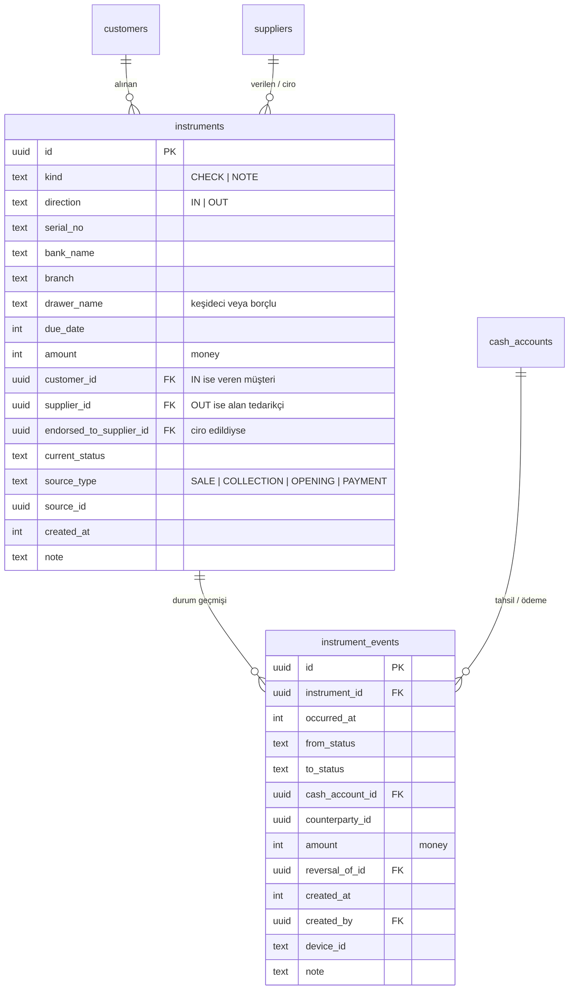

🔒 `instrument_events`

**Durum makinesi — ALINAN (`direction = IN`)**

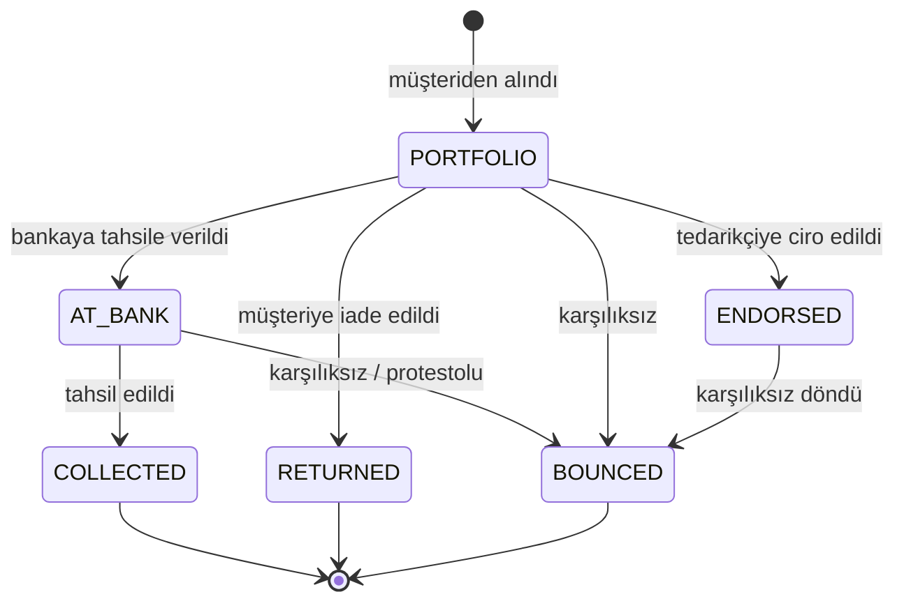

**Durum makinesi — VERİLEN (`direction = OUT`)**

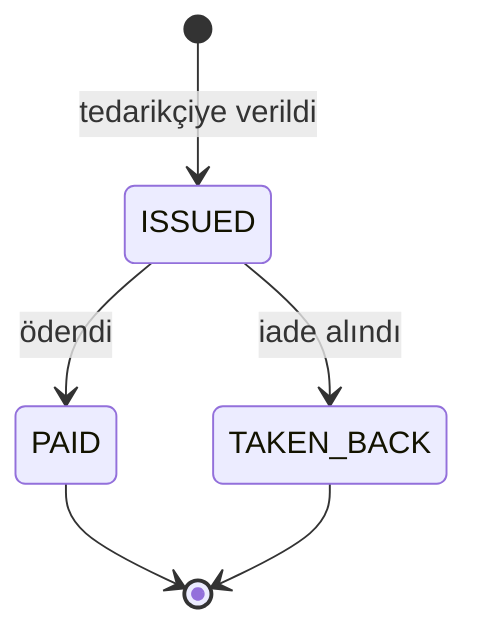

**Muhasebe etkileri**

| Geçiş | Etki |
|---|---|
| Müşteriden alınır (`→ PORTFOLIO`) | `customer_ledger` alacak (bakiye düşer), portföye girer |
| `→ COLLECTED` | Seçilen banka hesabına `account_movements` girişi |
| `→ ENDORSED` | Tedarikçi ödemesi: `supplier_ledger` borç azalır |
| `→ BOUNCED` | `customer_ledger`'a **ters kayıt** (bakiye geri artar), portföyden çıkar |
| `→ RETURNED` | `customer_ledger`'a ters kayıt |
| Verilen `→ ISSUED` | `supplier_ledger` borç azalır |
| Verilen `→ PAID` | Banka hesabından çıkış |

> Doğrulama (Altın Senaryo 10): 20.000,00 çek → bakiye 64.680 → 44.680, portföy 20.000.
> Karşılıksız → bakiye 64.680, portföy 0.

Geçerli olmayan geçişler domain katmanında reddedilir (`service/instrument_rules.dart`,
tablo testi). `instruments.current_status` bir **önbellektir**; doğrusu `instrument_events`
zincirinin sonucudur ve `checkIntegrity` bunu karşılaştırır.

---

## 10. Fason kesim

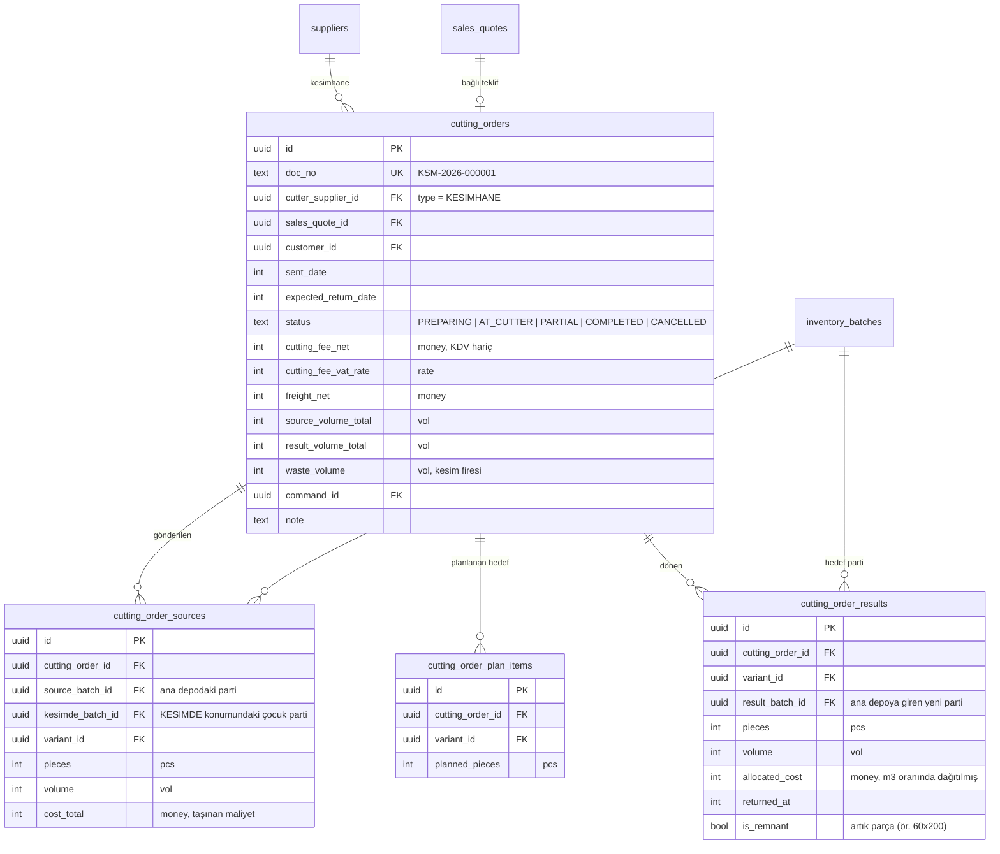

- `CHECK (result_volume_total <= source_volume_total)` — hedef toplam m³ kaynağı aşamaz.
- `waste_volume = source_volume_total − result_volume_total` → fire raporunda **"kesim
  firesi"** olarak miktarıyla görünür; ayrı maliyet kaydı yazılmaz, hedeflerin birim
  maliyetine yedirilir.
- Hedef partiler **kaynak partinin `received_at` değerini** taşır → FIFO sırası bozulmaz.
- Kısmi dönüş: her dönüşte `cutting_order_results` satırları eklenir, durum `PARTIAL` olur;
  kaynak tükenince `COMPLETED`.
- Kesim ücreti kesimhane carisine **brüt** borç yazılır; maliyete **KDV hariç** girer.

---

## 11. Sayım, fire ve açılış

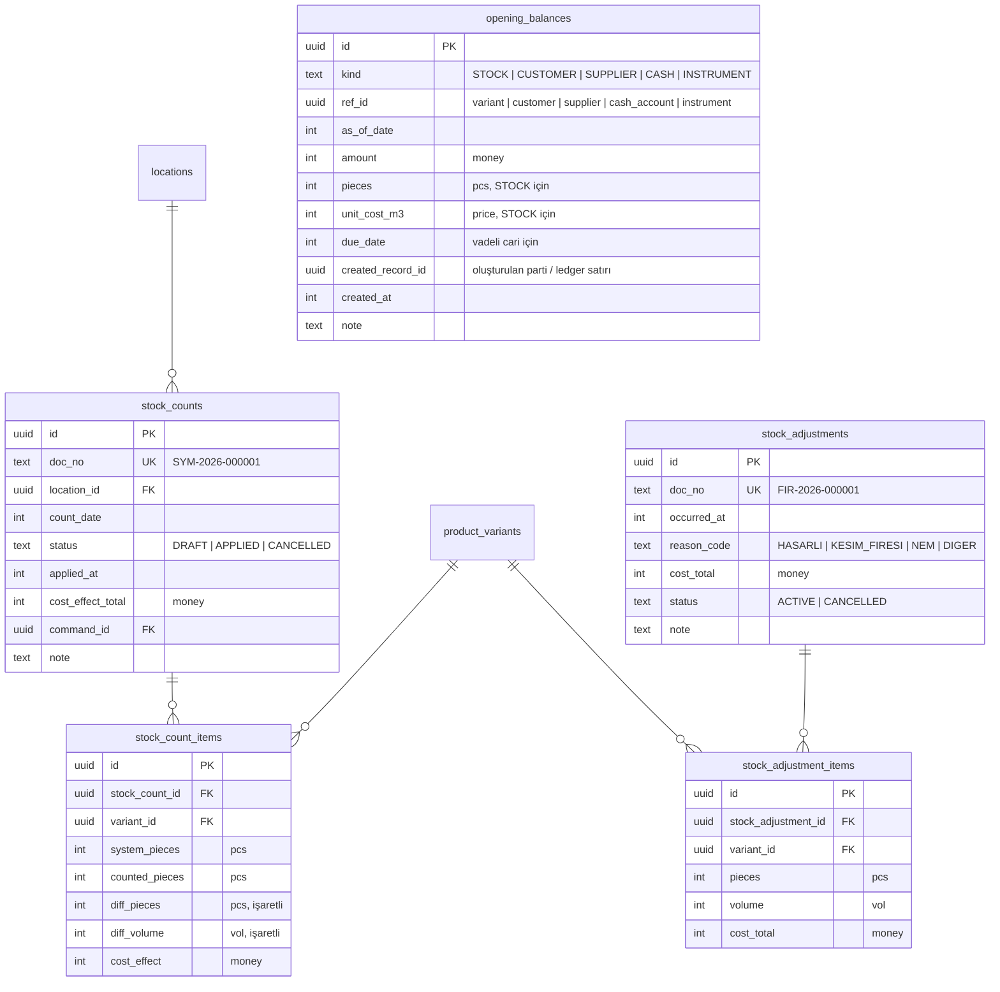

- Sayım `DRAFT` iken stok etkilemez; **onayda** (`APPLIED`) fark kadar `COUNT_IN`/`COUNT_OUT`
  hareketi yazılır. Eksik çıkan mal FIFO sırasıyla partilerden düşülür, maliyeti
  `cost_allocations`'a yazılır. Sayım onayı **riskli işlem**tir → öncesinde otomatik yedek.
  > Doğrulama (Altın Senaryo 6): 140×200×10 sistem 20 / fiziksel 19 → −1 adet, −0,28 m³,
  > maliyet 886,20 TL (B partisi, 3.165 TL/m³).
- Fire, FIFO sırasıyla partiden düşer ve kârlılık raporunda ayrı kalem olarak görünür.
  > Doğrulama (Altın Senaryo 7): 140×200×5 × 2 adet → −0,28 m³, 848,40 TL (A partisi, 3.030).
- Açılış stoğu, `source_type = OPENING` olan bir parti ve `OPENING_IN` hareketi üretir.
  Açılış cari bakiyeleri vadeleriyle birlikte `customer_ledger`/`supplier_ledger`'a
  `doc_type = OPENING` ile yazılır ve tahsilat eşleştirmesinde hedef olabilir.

---

## 12. Yedekleme günlüğü

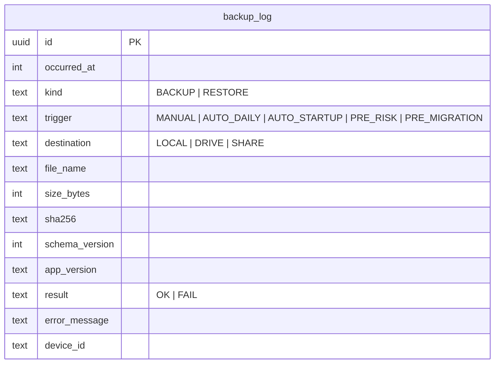

🔒 `backup_log` — "son cihaz dışı yedek" uyarısı `destination IN ('DRIVE','SHARE')` ve
`result = 'OK'` satırlarının en yenisinden hesaplanır.

---

## 13. Trigger listesi

| Tablo | no_update | no_delete |
|---|---|---|
| `stock_movements` | ✔ | ✔ |
| `customer_ledger` | ✔ | ✔ |
| `supplier_ledger` | ✔ | ✔ |
| `account_movements` | ✔ | ✔ |
| `instrument_events` | ✔ | ✔ |
| `cost_allocations` | ✔ | ✔ |
| `cost_adjustments` | ✔ | ✔ |
| `payment_allocations` | ✔ | ✔ |
| `supplier_payment_allocations` | ✔ | ✔ |
| `command_log` | ✔ | ✔ |
| `audit_logs` | ✔ | ✔ |
| `backup_log` | ✔ | ✔ |
| Belge başlıkları (`sales`, `purchases`, `collections`, `supplier_payments`, `sale_returns`, `purchase_returns`, `transfers`, `expenses`, `stock_adjustments`) | kısmi: yalnızca `status`, `cancelled_at`, `cancel_reason` değişebilir | ✔ |

Belge başlığı trigger'ı örneği:

```sql
CREATE TRIGGER trg_sales_status_only BEFORE UPDATE ON sales
WHEN OLD.doc_no      <> NEW.doc_no
  OR OLD.customer_id <> NEW.customer_id
  OR OLD.grand_total <> NEW.grand_total
  OR OLD.cost_total  <> NEW.cost_total
  OR OLD.doc_date    <> NEW.doc_date
BEGIN
  SELECT RAISE(ABORT, 'sales: yalnızca durum alanları güncellenebilir');
END;
```

---

## 14. Enum sözlüğü

Tüm enum'lar veritabanında `TEXT` olarak saklanır (okunabilirlik ve ileri uyumluluk için),
Dart tarafında `enum` ile temsil edilir ve `CHECK (col IN (...))` ile kısıtlanır.

| Enum | Değerler |
|---|---|
| `price_mode` | `EXCL`, `INCL` |
| `variant_kind` | `PLAKA`, `BLOK` |
| `location_code` | `ANA_DEPO`, `KESIMDE` |
| `supplier_type` | `FABRIKA`, `KESIMHANE`, `NAKLIYE`, `DIGER` |
| `costing_method` | `FIFO`, `WEIGHTED_AVERAGE` |
| `movement_type` | `PURCHASE_IN`, `SALE_OUT`, `SALE_RETURN_IN`, `PURCHASE_RETURN_OUT`, `COUNT_IN`, `COUNT_OUT`, `WASTE_OUT`, `TRANSFER_OUT`, `TRANSFER_IN`, `CUTTING_OUT`, `CUTTING_IN`, `OPENING_IN`, `REVERSAL` |
| `doc_status` | `ACTIVE`, `CANCELLED` |
| `quote_status` | `DRAFT`, `SENT`, `ACCEPTED`, `REJECTED`, `EXPIRED`, `CONVERTED` |
| `cutting_status` | `PREPARING`, `AT_CUTTER`, `PARTIAL`, `COMPLETED`, `CANCELLED` |
| `instrument_kind` | `CHECK`, `NOTE` |
| `instrument_direction` | `IN`, `OUT` |
| `instrument_status` (IN) | `PORTFOLIO`, `AT_BANK`, `COLLECTED`, `ENDORSED`, `BOUNCED`, `RETURNED` |
| `instrument_status` (OUT) | `ISSUED`, `PAID`, `TAKEN_BACK` |
| `payment_method` | `CASH`, `TRANSFER`, `CARD`, `CHECK`, `NOTE` |
| `cash_account_type` | `KASA`, `BANKA`, `POS` |
| `rounding_rule` | `NONE`, `NEAREST_1`, `NEAREST_5`, `NEAREST_10` |
| `allocation_key` | `VOLUME`, `AMOUNT` |
| `backup_kind` | `BACKUP`, `RESTORE` |
| `backup_trigger` | `MANUAL`, `AUTO_DAILY`, `AUTO_STARTUP`, `PRE_RISK`, `PRE_MIGRATION` |
| `backup_destination` | `LOCAL`, `DRIVE`, `SHARE` |

Türkçe karşılıklar yalnızca `ui` katmanında, tek bir çeviri haritasında tutulur.
