# İş Akışları

Her akış **tek bir Drift transaction**'ıdır ve form açılışında üretilen UUID ile
`command_log`'a yazılır (idempotency, `docs/ARCHITECTURE.md` §7).
Ortak ön koşul: işlem sürerken Kaydet butonu devre dışıdır.

Gösterim kısaltmaları: **SM** = `stock_movements`, **CA** = `cost_allocations`,
**CL** = `customer_ledger`, **SL** = `supplier_ledger`, **AM** = `account_movements`.

---

## 1. Alış (stok girişi)

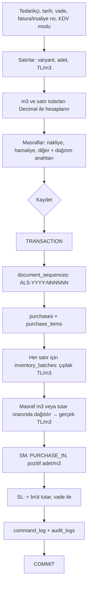

**Kurallar**

- Masraf dağıtımında kuruş farkı **son partiye** eklenir; `Σ pay = masraf` değişmezi.
- Çıplak fabrika fiyatı ve gerçek maliyet ayrı saklanır (SPEC §4).
- Cariye **brüt**, partiye **KDV hariç** tutar gider.

### 1.1 Sonradan gelen masraf

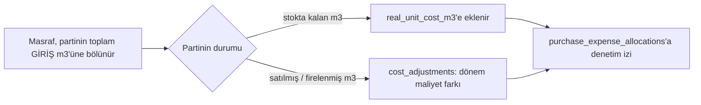

Geçmiş satış satırları **değişmez** (BRIEF §3.7, SPEC §30.3).

---

## 2. Hızlı satış

Hedef: tipik satış **30 saniyenin altında**.

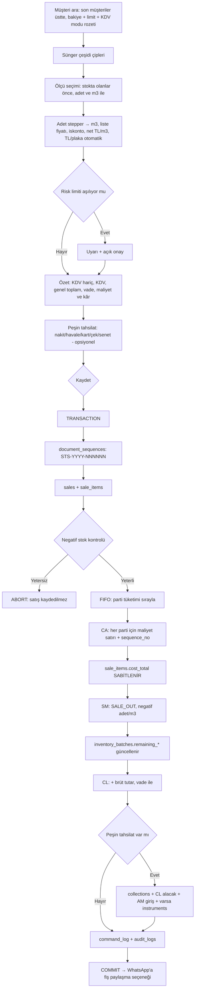

**Maliyet yöntemi ağırlıklı ortalama ise:** fiziksel tüketim yine FIFO'dur, ancak `CA`'ya
yazılan birim maliyet, **ürün bazında** ana depodaki tüm kalan partilerin m³ ağırlıklı
ortalamasıdır (D-11).

---

## 3. Satış iadesi

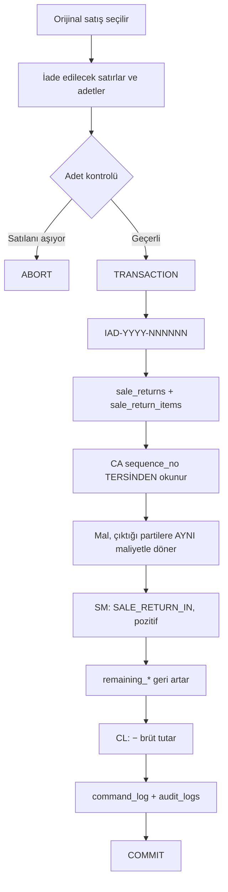

Orijinal satış **değişmez**; kâr raporunda iade ayrı görünür.
Alış iadesi aynı mantıkla ters yönde çalışır (`PURCHASE_RETURN_OUT`, `SL` alacak).

---

## 4. İptal (ters hareket)

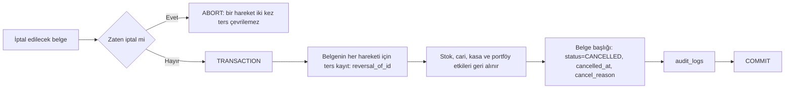

**Hiçbir kayıt silinmez** (SPEC §24, §30.10). Orijinal satırlar yerinde kalır.

---

## 5. Tahsilat ve eşleştirme

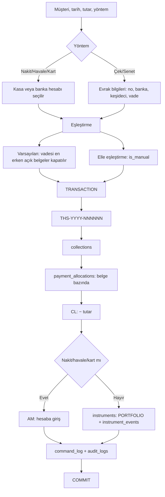

Vadesi geçen alacak, gecikme günü ve **ortalama ödeme süresi** `payment_allocations`
üzerinden hesaplanır (SPEC §11, §19). Tedarikçi ödemesi birebir aynı mantıktadır.

---

## 6. Çek / senet durum değişikliği

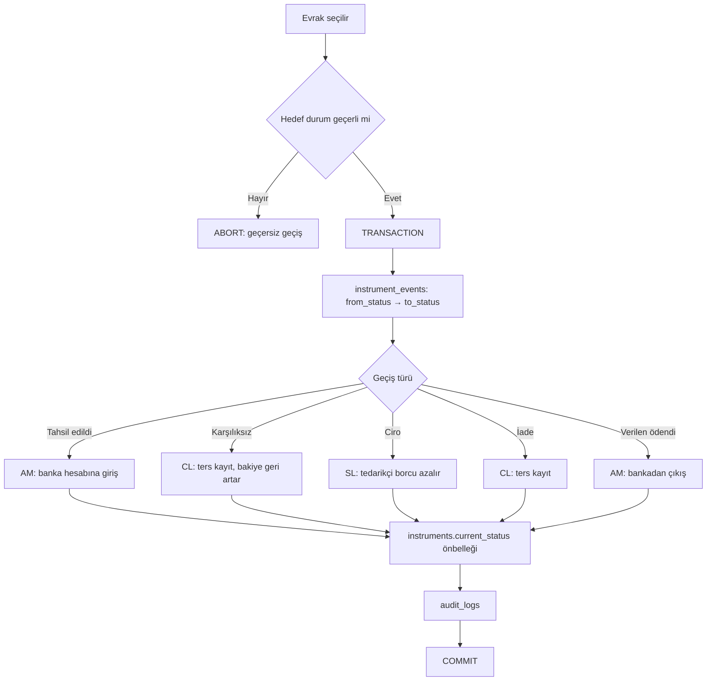

Geçerli geçişler `docs/ERD.md` §9'daki iki durum makinesindedir. Ana sayfada bu hafta
vadesi gelen evrak listelenir; vade gününden **bir gün önce** yerel bildirim gider.

---

## 7. Stok sayımı

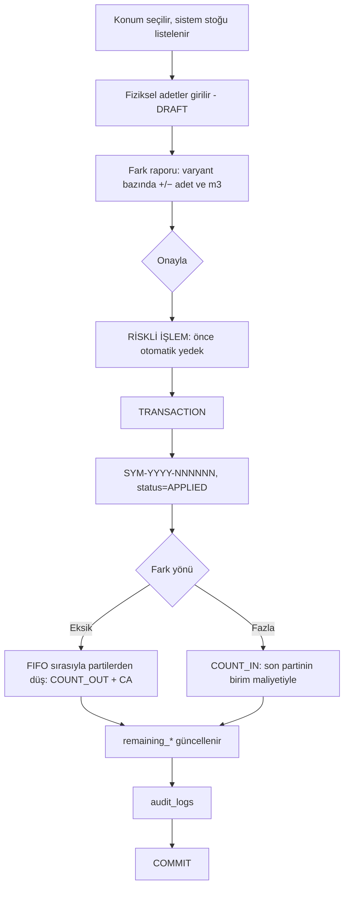

`DRAFT` iken stok **etkilenmez**. Geçmiş kayıt doğrudan değiştirilmez (SPEC §16).

---

## 8. Fire / hasar

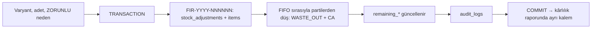

Neden zorunludur (SPEC §17): `HASARLI`, `KESIM_FIRESI`, `NEM`, `DIGER`.

---

## 9. Kesim emri (fason)

### 9.1 Kesime gönder

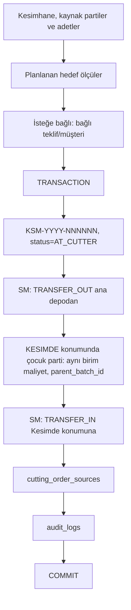

Kesimdeki mal **satılamaz** (`locations.is_sellable = false`), stok değerinde ayrıca
görünür, maliyetini aynen taşır.

### 9.2 Kesimden dönüş

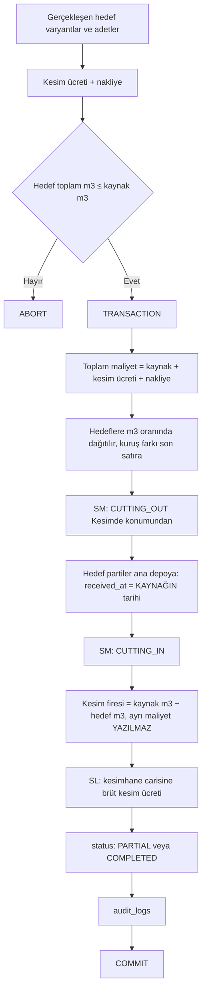

Kısmi dönüş desteklenir. Bağlı teklif varsa tamamlanınca **"Satışa dönüştür"** kısayolu çıkar.

---

## 10. Açılış işlemleri

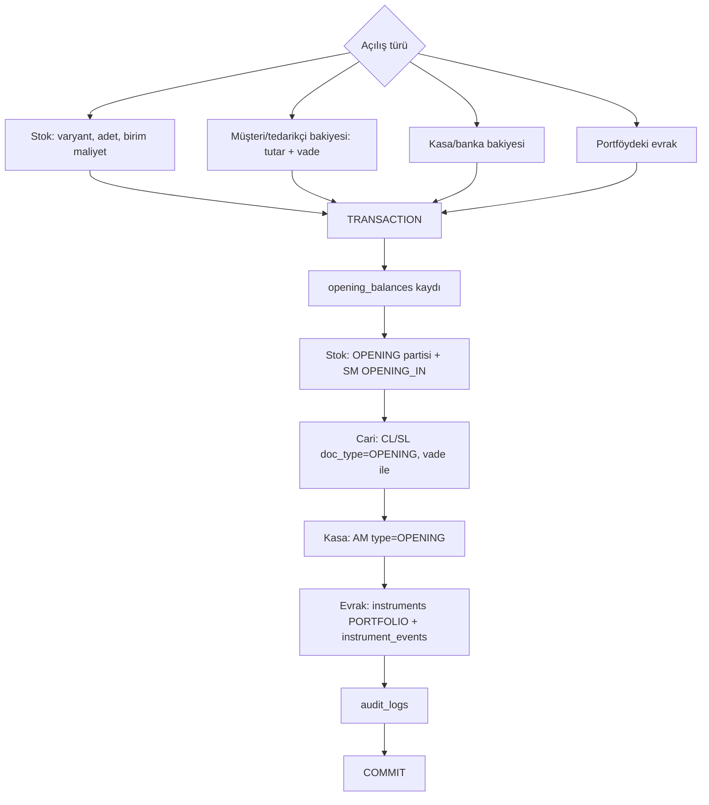

Açılış cari satırları tahsilat eşleştirmesinde **hedef olabilir** (`target_type = OPENING`).

---

## 11. Fiyat listesi versiyonu

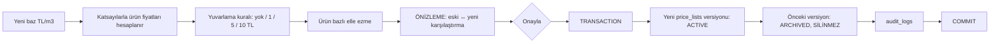

Geçmiş satışlar kendi versiyonuna referans verir (`sale_items.price_list_id`), bu yüzden
fiyat değişikliği geçmiş kârı **etkilemez** (SPEC §13, §30.11 · Altın Senaryo adım 5).

---

## 12. Yedek al / yedekten yükle

Ayrıntılı akış, dosya formatı ve hata senaryoları: **`docs/BACKUP.md`**.

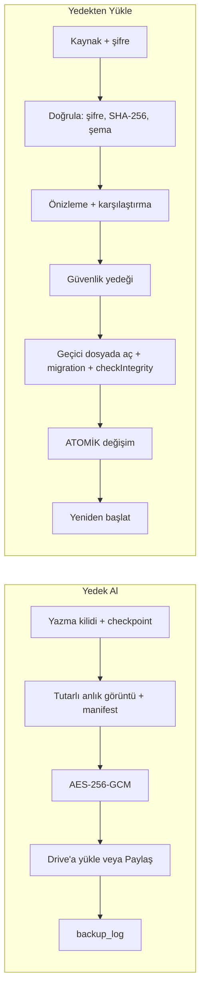

**Değişmez:** atomik değişime gelinmediği sürece mevcut veriye hiç dokunulmaz.
