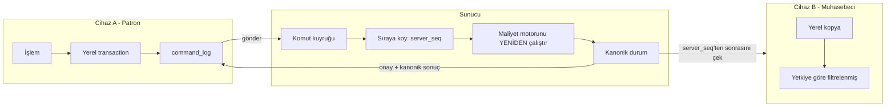

# Gelecek: İkinci Kullanıcı ve Sunucu Senkronizasyonu

**Bu doküman şimdi yapılmayacak işi tarif eder.** Amacı, v1'in bu yolu **kapatmadığını**
göstermek ve ikinci kullanıcı (Muhasebeci) gündeme geldiğinde işin nereden başlayacağını
belirlemektir. v1 kapsamı: tek kullanıcı, sunucusuz, offline (BRIEF §1.2, §1.3).

---

## 1. v1'de şimdiden hazır olanlar

| Hazırlık | Nerede | Neyi mümkün kılar |
|---|---|---|
| **UUID v7** kimlikler | Tüm tablolar | Cihazlar çakışmadan kayıt üretebilir; sıralanabilir |
| `users`, `roles`, `permissions` | Şema | Şema değişmeden ikinci kullanıcı eklenir |
| `created_by`, `device_id` | Her kayıtta | Hangi kaydı kimin hangi cihazdan ürettiği bilinir |
| **`command_log`** | Her yazma işlemi | Senkronizasyonun temeli (aşağıda) |
| Saf Dart `domain` | Katman ayrımı | Aynı maliyet motoru sunucuda yeniden çalıştırılabilir |
| Append-only hareket tabloları | Trigger'lar | Geçmiş değişmez; birleştirme çakışması yaratmaz |
| `SPEC §23` yetki kodları | `permissions` | Yetki listesi veri olarak duruyor |

---

## 2. Temel fikir: komut kuyruğu

v1 zaten her yazma işlemini `command_log`'a **komut** olarak düşürüyor (idempotency için).
Senkronizasyon bunun üzerine kurulur:



Gereken tek şema eklemesi: `command_log`'a `server_seq`, `synced_at` ve `sync_status`.
Bunlar append-only kuralını bozmamak için **ayrı** bir `command_sync_state` tablosunda
tutulur (`command_id` PK).

---

## 3. Sunucuda maliyetin yeniden işlenmesi

Maliyet **cihazın hesapladığına güvenilerek** kabul edilmez. Sunucu komutları `server_seq`
sırasıyla yeniden işler ve FIFO/ağırlıklı ortalamayı **kendisi** hesaplar.

**Neden:** iki cihaz aynı partiden eşzamanlı satış yaparsa, her biri kendi yerel durumuna
göre farklı parti tüketimi hesaplar. Kanonik sıra yalnızca sunucuda vardır.

`domain` katmanı saf Dart olduğu için sunucuda (Dart backend) **aynı kod** çalışır —
maliyet kurallarının iki ayrı dilde iki kez yazılması riski ortadan kalkar. Bu, D-01'deki
"domain'e Flutter sokma" kuralının asıl kazancıdır.

---

## 4. Çakışan satışların reddi

Senaryo: Patron ve Muhasebeci aynı anda son 5 plakayı satıyor.

```
1. Her iki komut da sunucuya ulaşır.
2. Sunucu server_seq sırasıyla işler.
3. İlk komut stoğu tüketir.
4. İkinci komut NEGATİF STOK üretir → REDDEDİLİR.
5. Cihaza "reddedildi + gerekçe" döner; yerel kayıt ters hareketle geri alınır
   ve kullanıcıya Türkçe açıklama gösterilir.
```

Bu, v1'in **negatif stok yasağı** (D-08 / BRIEF §3.8) kuralının doğal sonucudur — kural
zaten var, sunucu sadece onu kanonik sırada uygular.

Reddedilen komutlar `command_rejections` tablosuna yazılır ve kullanıcıya "senkronizasyon
sorunları" ekranında listelenir. **Sessizce yutulmaz.**

---

## 5. Yetki bazlı veri filtreleme

v1'de "maliyeti gizle" bir **gösterim** modudur (D-04) — tek kullanıcı, kendi cihazı, kendi
verisi. İkinci kullanıcıda bu yetmez:

| Katman | v1 | Sunucu geldiğinde |
|---|---|---|
| Maliyet/kâr | Ekranda gizlenir | Sunucu o alanları **hiç göndermez** |
| Alış fiyatları | Ekranda gizlenir | `permissions.COST_VIEW` yoksa yanıttan çıkarılır |
| Cari bakiye | Görünür | `LEDGER_VIEW` yetkisine bağlanır |

Kural: **yetkisi olmayan veri cihaza hiç inmez.** Aksi halde yerel veritabanından okunabilir
(ANALİZ §2.13). Bu yüzden senkronizasyon yanıtları yetkiye göre şekillenir, tek bir "hepsini
indir" ucu bulunmaz.

---

## 6. Yedekleme ile ilişkisi

Sunucu geldiğinde de **cihaz yedeği kaldırılmaz**. Sunucu ek bir kopyadır, yedeğin yerine
geçmez: internet yokken uygulama tam çalışmaya devam eder (BRIEF §1.2) ve o sırada üretilen
veri yalnızca cihazdadır. Sunucu tarafında ayrıca kendi yedek politikası kurulur.

---

## 7. Yapılmayacaklar listesi (v1)

Bu dosya bir plandır, bir taahhüt değildir. v1'de **kod yazılmaz**:
sunucu, senkronizasyon, ikinci kullanıcı, yetki arayüzü (BRIEF §5 "Kapsam dışı").

İkinci kullanıcı gündeme geldiğinde bu ayrı bir iş ve ayrı bir bütçedir
(`docs/ANALIZ_VE_PLAN.md` §4.4).
